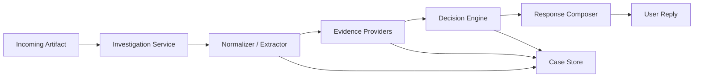

# TrustBot V2 Architecture

## Goal

TrustBot V2 should evolve from a single-pass heuristic classifier into a small investigation system that:

- stays risk-first
- treats "SAFE" as rare and evidence-backed
- asks for one precise follow-up when confidence is low
- keeps an auditable trail of how a verdict was reached

The V1 repo already has the right instinct:

- a tight FastAPI surface
- composable analyzers
- explicit reason codes
- a strong "need one more artifact" UX

V2 should preserve those strengths while improving accuracy, explainability, and product depth.

## Product Direction

### V1

Input -> route -> run heuristics -> average signals -> return verdict

This is good for proving the UX and the initial scam taxonomy.

### V2

Input -> create investigation -> collect artifacts -> extract claims/entities/actions -> run evidence providers -> aggregate weighted evidence -> decide verdict -> ask for next best artifact if needed

This changes TrustBot from "classifier" to "case worker".

That matters because scam detection is usually not solved by one artifact alone. Users often send:

- partial screenshots
- cropped text
- shortened links
- forwarded messages missing context

V2 should treat uncertainty as a normal state, not as a failure case.

## Core V2 Concepts

### 1. Investigation

An investigation is the top-level unit of work.

It contains:

- the original user submission
- all follow-up artifacts
- extracted entities and claims
- evidence collected by analyzers
- a final or provisional verdict

Suggested statuses:

- `OPEN`
- `WAITING_FOR_USER`
- `ANALYZING`
- `RESOLVED`
- `EXPIRED`

### 2. Artifact

Every user-provided thing is an artifact.

Examples:

- forwarded text
- URL
- screenshot
- PDF
- image resent as document
- optional context note

Each artifact should have:

- `artifact_id`
- `investigation_id`
- `type`
- `sha256`
- `mime_type`
- `source_channel`
- `created_at`
- normalized extracted text if available

### 3. Evidence Item

Each analyzer should emit structured evidence, not just a floating score.

Example:

```json
{
  "provider": "text_scam_patterns",
  "kind": "risk_signal",
  "code": "SCAM_OTP_REQUEST",
  "severity": "high",
  "weight": 0.92,
  "summary": "Message asks for an OTP.",
  "details": {
    "matched_phrase": "share OTP"
  }
}
```

### 4. Decision

The final decision should be based on weighted evidence, coverage, and contradictions.

Suggested verdicts:

- `RISKY`
- `NEED_MORE`
- `LIKELY_SAFE`

I would rename V1 `UNSURE` to `NEED_MORE` in the user-facing layer. It is more actionable and matches the product's core behavior.

Internally you can still keep an uncertainty score.

## What Changes Technically

### Current V1 Weaknesses

1. Signal averaging is too naive.
   A strong scam indicator can be diluted by several weak neutral signals.

2. Extraction and decisioning are mixed together.
   The system jumps from input directly to verdict.

3. Artifacts are stateless.
   V1 has ephemeral storage helpers, but investigations are not first-class.

4. Provenance is shallow.
   Redirects and page content hints are useful, but not enough for impersonation-heavy scams.

5. There is no evaluation harness.
   Without a labeled dataset, V2 risks becoming "more complex" without becoming "more accurate."

## Proposed Service Architecture

### High-level flow



### Suggested modules

```text
app/
  api/
    investigations.py
    artifacts.py
    health.py
  domain/
    models.py
    enums.py
    decision.py
    policies.py
  services/
    investigation_service.py
    artifact_service.py
    extraction_service.py
    evidence_service.py
    response_service.py
  providers/
    text_patterns.py
    url_static.py
    url_fetch.py
    domain_reputation.py
    impersonation.py
    document_extract.py
    image_screening.py
  storage/
    investigations.py
    artifacts.py
    evidence.py
  schemas/
    api_requests.py
    api_responses.py
```

This keeps V1's nice modularity but separates:

- API schema
- business logic
- evidence providers
- persistence
- decision policy

## API Shape

### 1. Create or continue investigation

`POST /v2/investigations/analyze`

Request:

```json
{
  "user_id": "u_123",
  "investigation_id": null,
  "artifact": {
    "type": "text",
    "text": "URGENT: Your KYC is pending. Share OTP now."
  },
  "locale": "en_IN",
  "channel": "whatsapp"
}
```

Response:

```json
{
  "investigation_id": "inv_01",
  "status": "WAITING_FOR_USER",
  "verdict": "RISKY",
  "confidence": 0.88,
  "headline": "This looks like a likely OTP scam.",
  "reasons": [
    "It asks for an OTP.",
    "It uses urgent account-block language."
  ],
  "recommended_action": "Do not share OTP or click any link.",
  "next_best_artifact": null,
  "artifacts_seen": 1
}
```

If more evidence is needed:

```json
{
  "investigation_id": "inv_01",
  "status": "WAITING_FOR_USER",
  "verdict": "NEED_MORE",
  "confidence": 0.41,
  "headline": "I need one more artifact to verify this safely.",
  "reasons": [
    "The screenshot is too compressed to read confidently."
  ],
  "recommended_action": "Please resend the image as a document or paste the original link.",
  "next_best_artifact": {
    "type": "resend_as_document",
    "why": "Higher-fidelity media enables OCR and visual checks."
  },
  "artifacts_seen": 1
}
```

### 2. Fetch investigation

`GET /v2/investigations/{investigation_id}`

Returns full case summary, current evidence, artifacts, and decision state.

### 3. Add artifact

`POST /v2/investigations/{investigation_id}/artifacts`

This enables the multi-turn loop directly instead of forcing everything through one request.

## Data Model

### Investigation

```json
{
  "investigation_id": "inv_01",
  "user_id": "u_123",
  "status": "WAITING_FOR_USER",
  "locale": "en_IN",
  "channel": "whatsapp",
  "created_at": "2026-03-10T18:00:00Z",
  "updated_at": "2026-03-10T18:01:15Z",
  "current_verdict": "NEED_MORE",
  "confidence": 0.41
}
```

### Artifact

```json
{
  "artifact_id": "art_01",
  "investigation_id": "inv_01",
  "type": "image",
  "mime_type": "image/jpeg",
  "sha256": "abc123",
  "text_content": null,
  "created_at": "2026-03-10T18:00:03Z"
}
```

### Evidence

```json
{
  "evidence_id": "ev_01",
  "investigation_id": "inv_01",
  "artifact_id": "art_01",
  "provider": "url_fetch",
  "code": "URL_REDIRECT_CHAIN",
  "direction": "risk",
  "weight": 0.68,
  "summary": "Link redirects multiple times.",
  "details": {
    "redirect_count": 4
  }
}
```

## Decision Engine

### Move away from simple averaging

Current V1:

- each pipeline emits a number
- all numbers are averaged

Problem:

- weak neutral evidence can flatten strong risk evidence
- evidence quality and evidence type are not handled separately
- conflicting evidence is not modeled explicitly

### Recommended V2 decision strategy

Use three buckets:

- `risk_evidence`
- `trust_evidence`
- `quality_penalties`

Then calculate:

- `risk_score`
- `trust_score`
- `coverage_score`
- `contradiction_score`

Pseudo-logic:

```python
risk_score = weighted_sum(risk_evidence)
trust_score = weighted_sum(trust_evidence)
quality_penalty = weighted_sum(quality_penalties)

net_score = risk_score - trust_score - quality_penalty_adjustment

if risk_score >= 0.85 and coverage_score >= 0.45:
    verdict = "RISKY"
elif trust_score >= 0.85 and contradiction_score < 0.2 and coverage_score >= 0.65:
    verdict = "LIKELY_SAFE"
else:
    verdict = "NEED_MORE"
```

### Important policy rule

`LIKELY_SAFE` should require positive evidence, not just absence of negative evidence.

Examples of positive evidence:

- official domain matches claimed entity
- domain reputation passes
- message content aligns with trusted sender pattern
- no credential/OTP/payment pressure
- consistent sender + URL + branding

This is the biggest product safeguard in V2.

## Evidence Providers

### Keep from V1

- text scam patterns
- URL static checks
- redirect/provenance checks
- image quality screening
- document extraction

### Add in V2

#### 1. Entity and intent extraction

Extract:

- claimed organization
- requested action
- urgency pattern
- money / OTP / login request
- delivery mechanism

Example output:

```json
{
  "claimed_entity": "HDFC Bank",
  "requested_action": "share OTP",
  "risk_theme": "account_lockout"
}
```

#### 2. Impersonation detector

Check:

- claimed brand vs actual domain mismatch
- brand keywords in suspicious domains
- visual logo hints from OCR/text if available

This is likely one of the highest-value V2 additions.

#### 3. Domain reputation provider

Potential checks:

- domain age
- registrar patterns
- ASN / hosting patterns
- disposable or newly created domains
- known URL shortener expansion

#### 4. Page intent classifier

Instead of only detecting forms, classify landing page purpose:

- login page
- payment page
- file download page
- government notice
- courier tracking page
- generic marketing page

#### 5. Conversation context provider

If the user adds 1-2 lines like:

"This claims to be from my bank but came from a forwarded family group"

that context should alter the decision and explanation.

## User Experience

### Response format

Every response should contain:

- verdict
- confidence
- short headline
- top 2-4 reasons
- one recommended action
- one next-best artifact when unresolved

### Good user-facing copy

Avoid:

- "Model score: 0.63"
- "Potential phishing vectors detected"

Prefer:

- "This asks for your OTP, which legitimate support teams should not request over chat."
- "The link redirects through a shortener and lands on a login-like page."

### Response tiers

#### `RISKY`

- say what is risky
- say what not to do
- give one safe verification path

#### `NEED_MORE`

- explain exactly what is missing
- request exactly one artifact

#### `LIKELY_SAFE`

- explain why it looks legitimate
- still mention a light caution for money/identity actions

## Suggested Persistence

For V2, move beyond in-memory ephemeral storage.

Use:

- SQLite for local/dev
- Postgres in production
- object storage for files if media volume grows

Tables:

- `investigations`
- `artifacts`
- `evidence_items`
- `decisions`
- `provider_runs`

This also unlocks:

- case history
- auditability
- replaying decisions after rule changes
- evaluation on real anonymized samples

## Evaluation Plan

This is mandatory for V2.

Create a dataset with labels such as:

- `scam_otp`
- `scam_kyc`
- `scam_payment_collect`
- `benign_transactional`
- `benign_marketing`
- `official_notice`
- `ambiguous`

For each case, store:

- original artifact
- ground truth label
- expected verdict
- expected explanation themes

Track:

- false-safe rate
- risky recall
- need-more precision
- evidence-request resolution rate

North star metric:

- minimize false `LIKELY_SAFE`

## Suggested Rollout Plan

### Phase 1: Refactor for investigations

- introduce investigation and artifact models
- add persistent storage
- preserve current heuristics as providers
- add `/v2/investigations/analyze`

### Phase 2: Stronger decisioning

- replace average fusion with weighted evidence aggregation
- distinguish risk, trust, and quality evidence
- add explanation templates

### Phase 3: Impersonation and reputation

- add claimed-entity extraction
- add domain reputation provider
- add brand/domain mismatch detection

### Phase 4: Evaluation and tuning

- build benchmark dataset
- tune thresholds using held-out data
- add regression tests for known scam families

### Phase 5: Channel integration

- WhatsApp-adjacent ingestion workflow
- email/SMS forwarding support
- case continuation with follow-up artifacts

## Practical Folder Migration From V1

You do not need to rewrite everything.

A low-risk migration path is:

1. Keep current pipeline logic but rename it as providers.
2. Introduce `Investigation` and `Artifact` domain models.
3. Add a new decision engine alongside current `fuse()`.
4. Build V2 API routes in parallel with `/v1/analyze`.
5. Deprecate V1 only after evaluation is in place.

## Concrete Recommendation

If you want the highest leverage V2, I would prioritize these four things first:

1. Investigations + artifacts as first-class objects
2. Weighted evidence decision engine
3. Claimed-entity / impersonation detection
4. Evaluation dataset and false-safe tracking

Those four would meaningfully change product quality.

More OCR or more heuristics alone will not.

## What V2 Should Feel Like

The user should feel:

- "It understood what this message is trying to get me to do."
- "It told me exactly why this is suspicious."
- "When uncertain, it asked for the one thing that would actually help."
- "It is careful about saying something is safe."

That is the bar worth building toward.
